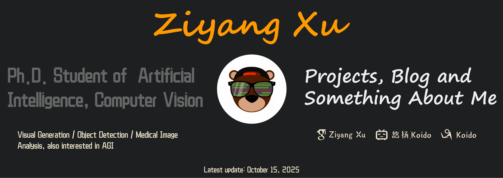

<!--  -->

# Hello, folks! 

I'm Ziyang Xu, pursuing my first-year PhD degree in the School of Electronic Information and Communications [(EIC)](https://eic.hust.edu.cn/) at Huazhong University of Science and Technology [(HUST)](https://www.hust.edu.cn/), benefitting from the guidance of Professors [Xinggang Wang](https://xwcv.github.io/) and [Wenyu Liu](http://eic.hust.edu.cn/professor/liuwenyu/).

Currently building interesting Deep Learning algorithms. Watch this space for updates.

Find me here: [personal website](https://ziyangxu.top/) or read my articles here: [blog](https://www.cnblogs.com/XZyoung). Pass by and check out my: [projects & papers](https://ziyangxu.top/).

<!--  -->

